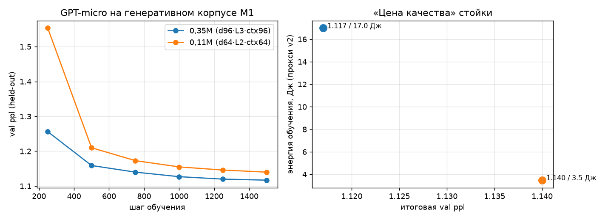

# RIG_REPORT — M1 «Измерительная стойка v1» (2026-08-05)

Статус: **стойка собрана и откалибрована точкой отсчёта**. Одна команда воспроизводит всё:

```bash
bash scripts/setup_env.sh                      # среда (после сброса песочницы)
python3 scripts/build_corpus.py                # корпус + токенизатор → data/
.venv/bin/python experiments/exp03_gptlite.py --steps 1500 --tag d96l3-ctx96-baseline
.venv/bin/python experiments/exp03_gptlite.py --steps 1500 --dim 64 --layers 2 --ctx 64 --tag d64l2-ctx64-small
.venv/bin/python scripts/plot_rig.py           # графики → benchmarks/rig_m1.png
```

Лог всех прогонов: `benchmarks/runs.jsonl` (формат строки: `{rig, tag, cfg, params, val_ppl_final,
energy_pj_per_token_train, energy_j_total_train, wall_s, tok_per_s, ts}`).

## Среда прогона

| Компонент | Значение |
|---|---|
| Железо | песочница: 2 CPU-ядра, 3,9 ГБ RAM, GPU нет, RAPL/powercap нет |
| Стек | python 3.11, torch 2.1.2 (CPU-режим; nvidia-* библиотеки нужны только для импорта), numpy 1.26 |
| Данные | генеративный корпус (src/aira/corpus.py v0.1): train 36 000 текстов / 8,13 М токенов-символов; valid 2 306 / 0,58 М, **прямая проверка: пересечения с train нет** |
| Токенизация | посимвольная, словарь 64 id (60 символов + 4 спец.) |

## Контрольная точка отсчёта (два бейзлайна, Pareto)

| Модель | Параметров | Токенов обуч. | val ppl | Энергия обуч. (прокси) | Время | Ток/с |
|---|---:|---:|---:|---:|---:|---:|
| GPT-micro d96·L3·ctx96 | 348 480 | 4,61 М | **1,117** | 17,0 Дж | 126 c | 36 600 |
| GPT-micro d64·L2·ctx64 | 107 136 | 3,07 М | 1,140 | 3,5 Дж | 41 c | 74 200 |



Что видно:
- корпус выучивается почти до энтропийного пола шаблонного мира (случайны лишь «слоты»
  имён/мест/предметов) — стойка **исправна**: модель действительно учится, метрика чувствительна;
- «цена качества» по Pareto правдоподобна: −0,02 ppl стоит ×4,9 энергии и ×3 времени;
- абсолютные величины тренировочной энергии доминируются MAC'ами при fp16-учёте
  (3,7 мкДж/токен у 0,35M против ~1,1 мкДж/токен у 0,11M) — масштабирование ∝ размеру модели,
  как и предписывает прокси v2.

## Что считает прокси v2 (допущения в явном виде)

`src/aira/energy.py`: MAC fwd+bwd = 3·(N + 2·L·d·ctx) на токен по цене e_mac(fp16)=3 пДж;
транспорт весов fp16 ×2 прохода + AdamW 26 Б/парам/шаг по цене e_HBM=15 пДж/Б;
активации — в идеальном SRAM (нижняя граница). Это **прокси**, не ваттметр: реальные ватты
подключим на железе с RAPL/nvidia-smi (PROTO_ROADMAP §M1, ворота).

## Честность стойки (ROADMAP §4)

- train/valid разделены программно (фильтр пересечений: из 3 600 кандидатов valid выкинуто 1 294
  совпадения — маленький мир коллидирует, и мы это фиксируем, а не прячем);
- seed'ы фиксированы (модель 42, данные 1000/2000/9000/9100), история прогонов сохраняется;
- прокси-допущения открыты в коде и здесь.

## Следующие шаги по M1 (перед воротами в M2)

1. Семплирование и глазная проверка текстов обученной точки (пока только ppl).
2. Батарея «мир фактов»: zero-shot QA по факт-слою корпуса (заготовка одноразовой памяти M5).
3. Третий бейзлайн-кандидат для сравнения локальности кредита: тот же GPT-micro, но обучение
   равновесным PC-апдейтом (src/aira/pc.py как солвер обратного прохода) — мост к M2.
4. BPE-16k, когда корпус вырастет за шаблонный мир.

Вердикт M1: **ворота PROTO_ROADMAP §M1 выполнены** (стойка: данные+метрика+энергопрокси+лог,
≥2 бейзлайна, одна команда воспроизводства). M2 можно начинать.
