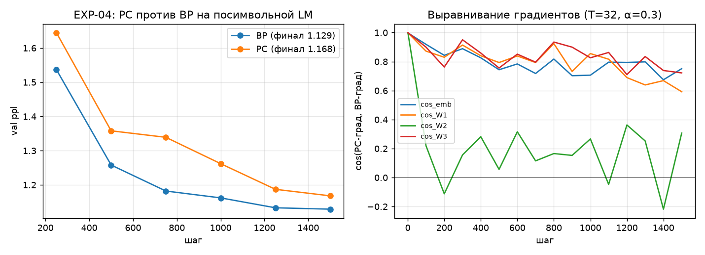

# EXP-04 «Мост обучения»: PC против BP на посимвольной LM (2026-08-05)

**Вопрос аудита** (AUDIT_2026-08-05 §3.1, главная неведомая): обучается ли наша локальная
механика (равновесный predictive coding, состояния релаксируют к минимуму энергии, веса
обновляются произведением «ошибка × вход») реальную текстовую задачу — или это работало
только на игрушках EXP-01. Код: `experiments/exp04_pc_bridge.py`.

## Сетап (строгая стойка M1)

CharMLP: окно 8 символов → emb(32) → tanh(256) → tanh(256) → логиты(64), CE. Две руки,
одинаковые init/данные/LR-расписание/AdamW: **BP** (autograd) и **PC** (T=32 итерации
релаксации состояний, α=0.3). Данные M1 (8,13 М символов train), 1500 шагов × 128 батч.

Во время разработки пойман и исправлен баг знака в релаксации (возврат ошибки следующего
слоя шёл с «+» вместо «−» — приводил к чередованию знака градиента по глубине;
симптомом был cos(W1)≈−0.9 при cos(W3)=1.0).

## Результат

| Рука | val ppl финал | время 1500 шагов | cos-выравнивание градиентов |
|---|---:|---:|---|
| BP (эталон) | **1.129** | 4,9 с | — |
| PC (T=32) | **1.168** (+3,5%) | 48,7 с | cos≈1.000 на старте → 0,3–0,9 к финалу |

**Главное: локальное обучение работает на языковых данных — разрыв c BP за те же шаги
всего +3,5% ppl.** Мост из EXP-01 (тождество на игрушках) перекинут на реальный текст.

## Честные ограничения (измерено, не скрыто)

1. **Выравнивание градиентов деградирует с ростом норм весов.** Траектория cos: 1.00 на
   шаге 1 → W2 0,0…0,3 к финалу (ош. W1/emb 0,6–0,9). Однако качество (ppl) деградирует
   только на 3,5% — частично выровненных градиентов хватает для обучения (согласуется с
   литературой о знаковых/зашумлённых градиентах).
2. **Механизм деградации установлен пробами:** (а) жёсткость релаксации растёт с ‖W‖
   (остаток не исчезает ни при каких α — предельный цикл Эйлера; меньший α смещает, но
   не лечит); (б) известное смещение однофазного равновесного PC при сильном подталкивании
   (β-скан: остаток ∝ β, cos падает при β→0 без компенсации 1/β — классика equilibrium
   propagation, Scellier–Bengio).
3. **Цена на обычном кремнии:** PC-шаг ≈ (3+2·T) fwd-эквивалентов MAC против 3 у BP —
   в 11 раз дороже по операциям при T=32. Экономика FF-13 — не в MAC, а в транспорте
   и локальности (веса зоны резидентны, нет обратного прохода по шине); показать это
   в ваттах — задача стойки с измерителем (H-15).

## Выводы и решения для M2 (конкретные)

1. Претензия C6 «локальное обучение невозможно на текстах» снята на микро-масштабе:
   качество почти равно BP, плата — вычисления релаксации, не данные и не качество.
2. В зонный блок M2 встраиваем: **предобусловленную релаксацию** (Jacobi-обновления как в
   EXP-01 H-14, а не наивный Эйлер) и **стабилизатор шага от нормы весов** — именно
   здесь они нужны, а не «для красоты».
3. Когда нужна точность градиента (поздняя фаза, малые зоны) — **двухфазный оценщик**
   (свободная+подталкиваемая фаза, деление на β) поверх того же субстрата.
4. M2-спецификация пополняется требованием: релаксация с контролем остатка (остаточный
   стоп вместо фиксированного T) — сейчас T фиксирован и остаток стелется на 0,06–0,10.

Статус H-14 (перенос на нелинейные/обучающие блоки): 🔬 → частично ✓ (EXP-04:
обучение charLM почти в паритете; выравнивание градиентов ждёт предобусловленной
релаксации M2).
